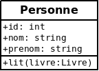
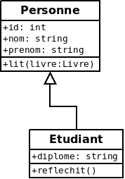
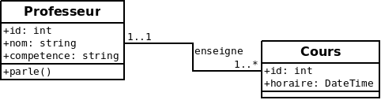
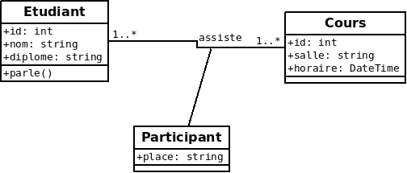
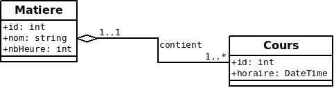
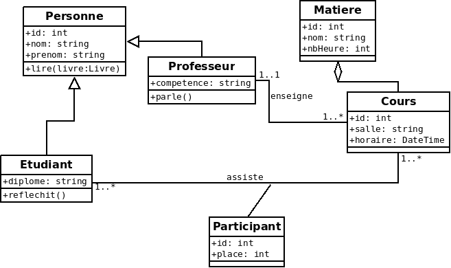

 <h1>Modélisation des données</h1> 

# Introduction
La modélisation des données est l'une des étapes la plus importante d'un projet informatique.  
Elle permet de définir le côté back-end du logiciel.  
A partir de cette modélisation, le développeur peut définir la base de données et les classes.  
En effet, les classes et la base sont étroitement liées. Le plus souvent une table a pour correspondance une classe qui aura les mêmes propriétés.
.  
3 outils sortent du lots : PowerAMC, ArgoUml et Dia.  
PowerAMC est un logiciel trés puissant mais onéreux et donc utilisé pour les sociétés importantes.    
ArgoUml est un logiciel gratuit, assez complet.  
Dia est un éditeur de diagrammes. Il est simple d'utilisation mais pas assez complet.  
C'est ce dernier est utilisé dans ce tuto.  

# DIA
Installation : `apt-get install dia`.  
Modélisation du MOO et des tables.  
Il permet aussi de générer du code PHP et du script SQL.  

# Modélisation des objets : ce qu'il faut retenir
Pour modéliser simplement, il faut aller à l'essentiel.  
A ce niveau, on ne déclare pas les clefs étrangères dans les propriétés.  
C'est la cardinalité qui indique s'il y aura un import.

## Classe
La classe est l'entité que l'on va décrire.
On définit le nom, les propriétés et les méthodes.   

## Héritage

## Association 1 n

La clef étrangère sera importée dans *cours*  

## Association n n

Création d'un nouvelle classe contenant les 2 id.  

## Aggrégation

C'est une relation 1 n  

## Schéma global

# Génération des tables à partir des classes
* Toutes les propriétés deviennent de champs
* Pour les assiociations, il y a import des id ou création nouvelle table.
* L'import des id entraine la création d'une clef étrangère (foreign key). A faire manuellement.

## Héritage
2 solutions :
* créer 2 tables
* importer les champs dans la table fille
## Associations
### Association 1 1
2 solutions :
* copie des champs dans la table maître si c'est la seule association
* 2 tables
### Association 1 * et aggrégation
import de l'id de cardinalité 1 dans la table de cardinalité *
### Association * *
création d'un table intermédiaire contenant les id des 2 tables.

## solution 

# clef et index
Les clefs et les index permettent un accès rapide aux données, et servent aussi de contrainte d'intégrité de la base.

## clef primaire
Depuis quelques années, nous utilisons des id en tant que clef primaire.  
C'est un entier auto-incrémenté qui est uniqe.
Ceci simplifie grandement les relations entre les tables.  
Il a l'inconvénient de ne pas contrôler les doublons.
Il s'agit d'un id technique qui ne doit pas être visible pour l'utilisateur.  
Même si la clef primaire n'est pas obligatoire en MYSQL, vous devez en déclarer une **obligatoirement**.
C'est une erreur de conception d'avoir une table sans clef primaire.

## clef fonctionnelle
Avant l'utilisation systématique des id en tant que clef primaire, le concepteur déterminait tous les champs constituant l'unicité d'un enregistrement.
Aujourd'hui, il est fortement recommandé de créer une clef fonctionnelle.
Cette clef est un index unique, et contient les champs clef autre que l'id primaire.  
L'ajout de cette clef vous oblige à déterminer l'unicité des enregistrements et contribue fortement à l'intégrité de la base.
 
## clef étrangère 
C'est cette clef qui fera la relation entre les 2 tables et maintiendra en partie l'intégrité de la base.
Cette clef vérifie si l'enregistrement étranger existe.

## index
Les index permettent une lecture plus rapide de la base en fonction des champs indexés.  
En théorie, on pourrait avoir autant d'index que de critères de recherche.  
Cependant les index sont couteux en place et en temps d'écriture.  
De plus les processeurs et les moteurs de base de données sont devenus très performants. 
Une lecture séquentielle est bien souvent plus efficace.  
En fait tout dépend de l'utilisation de la base :
* nombre d'enregistrements
* table utilisée principalement en lecture
* table utilisée principalement en écriture 
* fréquence de la requête

# Comment éviter une perte de maj 
Lors d'une maj d'un enregistrement, la philosophie "last writer wins" peut avoir ses limites.  
Supposons la séquence suivante :
1. l'utilisateur U1 lit un enregistrement
2. l'utilisateur U2 lit le même enregistrement
3. l'utilisateur U2 modifie cet enregistrement.
4. l'utilisateur U1 modifie aussi cet enregistrement mais après U2.  

Que se passe t'il ? Les modifcation de U2 sont perdues sans que quiconque en soit averti.  
Cette situation n'est pas concevable pour l'utilisateur.  
Cette situation pour être résolue en ajoutant un champ version :
* soit un champ numéro de maj qui est incrémenté à chaque enregistrement
* soit une date de maj en TIMESTAMP  

Lors de la maj de l'enregistrement, il suffit de vérifier dans la base si ce champ n'a pas évolué.  
Ou d'ajouter dans l'UPDATE en plus de l'id, la condition sur le champ version.

# Normalisation des bases de données
Il existe 6 niveaux de forme normale. Une base de données relationnelle doit être au minimum en 3ème forme normale. 

## 1ère forme normale
Une relation est en 1ère forme normale si elle ne contient que des "valeurs atomiques", c'est-à-dire pas de "groupes répétitifs".
Un champ contient une valeur au plus : pas de tableau, ni de liste.

## 2ème forme normale
Une relation est en 2ème forme normale si elle est déjà en 1ère forme normale, et si tout attribut n’appartenant pas à la clé (primaire) dépend complètement de cette clef.  
Un champ non clé primaire ne doit pas dépendre d'une partie de la clé primaire. Il doit en dépendre entièrement.

## 3ème forme normale
Un champ non clé primaire ne doit pas dépendre d'un autre champ non clé primaire.  
Dans ce cas, on peut décomposer la table en deux tables afin d'éviter une redondance d'informations dans la base.

# pièges à éviter lors de la conception et évolution de la base
* Un schéma complexe donnera une base complexe et une application complexe. Il faut donc prendre le temps de bien réfléchir.  
* Une modélisation mal pensée donnera une mauvaise application.
* Il faut aussi penser à l'évolution du système. Un logiciel vit. La description des données doit donc évoluée avec le temps. Mettre à jour le schéma d'une base de données sans mettre à jour le MOO rendra rapidement ce dernier inutile.
* Lors d'une évolution d'une base mise en production, il faut penser aux données existantes. If faudra passer un incrémental compatible et efficace.
* Survoler la notion de clef primaire, fonctionnelle, étrangère.
* Utilisation immodérée des index.
* Déclarer les VARCHAR avec des longueurs aléatoires. Il faut bien réfléchir à la longueur d'un champ texte.
* Oublier une contrainte. Lors de l'ajout, l'incrémentale d'une base existante peut stopper car la contrainte est impossible à résoudre.
